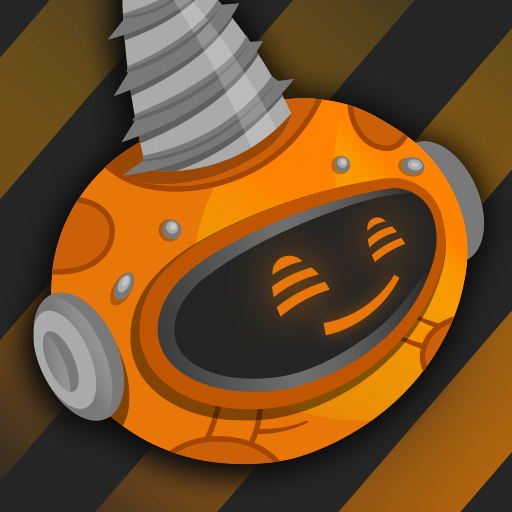
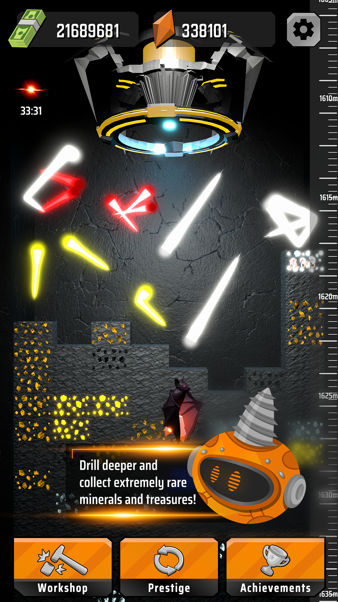
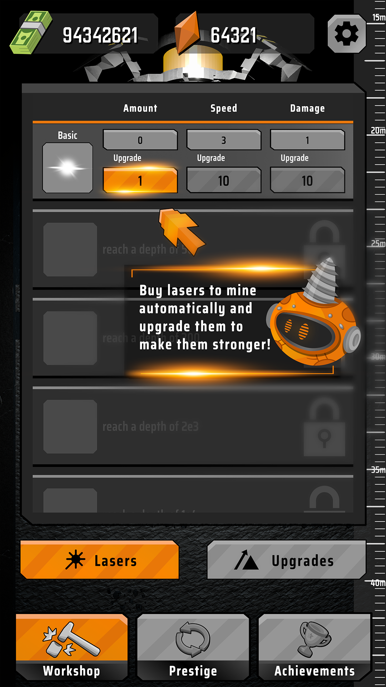
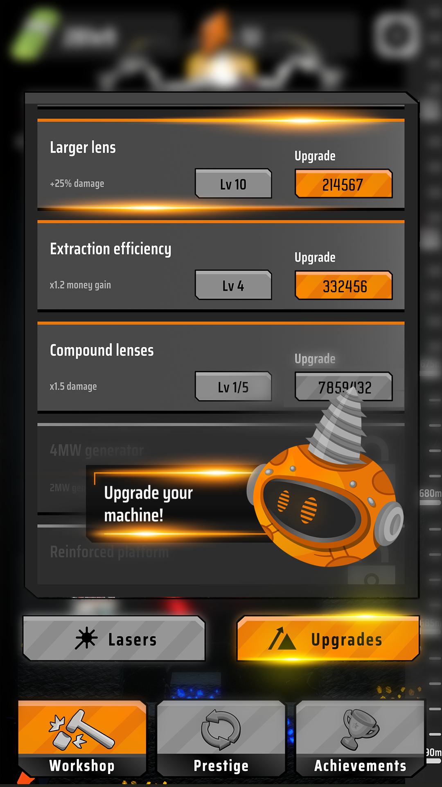

# Laser Inc. Idle Miner

## Description

Laser Inc. Idle Miner is an idle clicker game where player controls a laser drill to dig for riches. They can upgrade the drill, discover new technologies, and mine efficiently to earn money. As players progress, challenges increase, requiring strategic upgrades. The game features 3D graphics and simulated physics for an immersive experience.

## Showcase

## Gameplay

## App store description

Take control of a powerful laser drill in “Laser Inc. Idle Miner” and start digging for riches in this exciting game about mining - perfect for fans of simulation games and digging games! In this mobile game, you'll explore a fully automated mining world where you must delve as deep as possible to make your fortune.

With your trusty laser drill at your fingertips, you can buy and upgrade it to make it even more powerful. As you dig deeper, you'll encounter new technologies that can help you to mine more efficiently and earn even more money.

But be warned - the deeper you go, the more challenging the game becomes. To succeed, you'll need to acquire powerful upgrades that require you to rebuild your miner from scratch.

This mining game features stunning 3D graphics and simulated physics, immersing you in a beautiful and realistic environment. So, get ready to dig deep and strike it rich in this thrilling laser game!

---

### Used technologies

[<picture><source media="(prefers-color-scheme: light)" srcset="https://api.iconify.design/bi:unity.svg?color=%23000000" /></picture>](https://unity.com "Unity")

